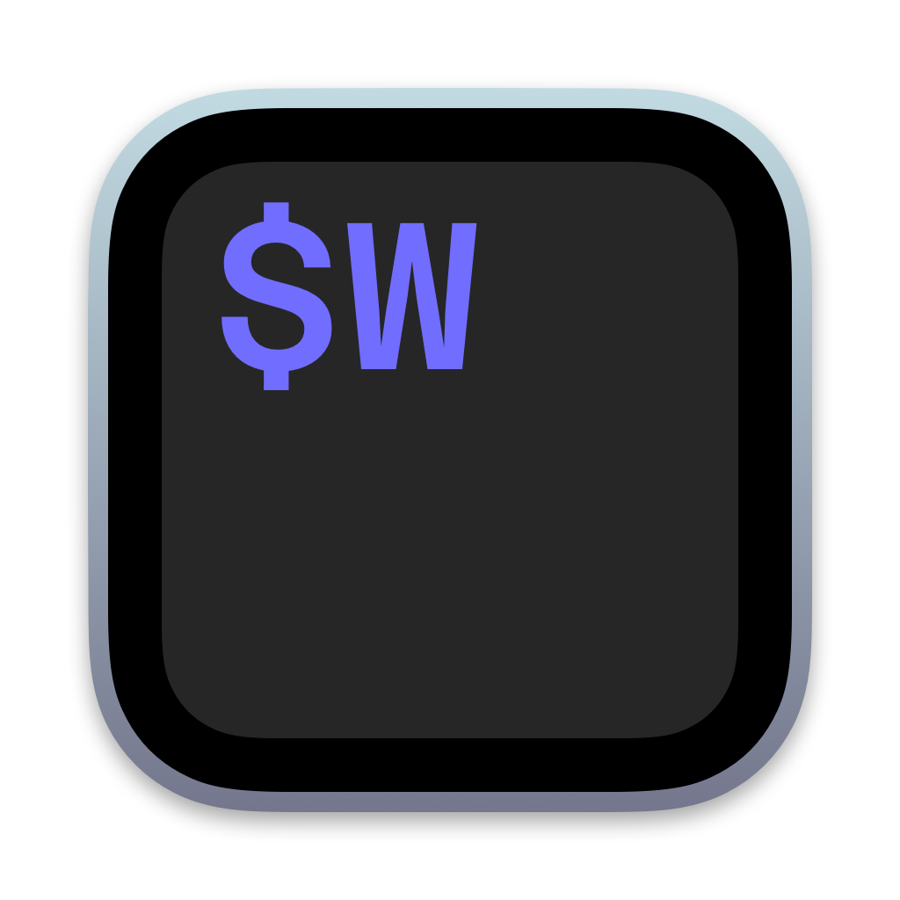

# WezTerm Application Icon

<p float="left">
	
</p>

An alternative MacOS application icon for [WezTerm](https://wezfurlong.org/wezterm/).

### Installation

```sh
$ make install
```

### Manual installation

- Find `WezTerm.app` in the `Applications` folder, select it and press `⌘ + i`.
- Drag `wezterm.icns` onto the application icon in the `WezTerm info` pane.
- Delete the icon cache and restart `Dock`:

```bash
$ rm /var/folders/*/*/*/com.apple.dock.iconcache
$ rm -r /var/folders/*/*/*/com.apple.iconservices*
$ killall Dock
```

### Building

Requires [node](https://nodejs.org/en/) and [npx](https://www.npmjs.com/package/npx).

```bash
$ make
```

### Inspiration

- [kitty-icon by DinkDonk](https://github.com/DinkDonk/kitty-icon)
